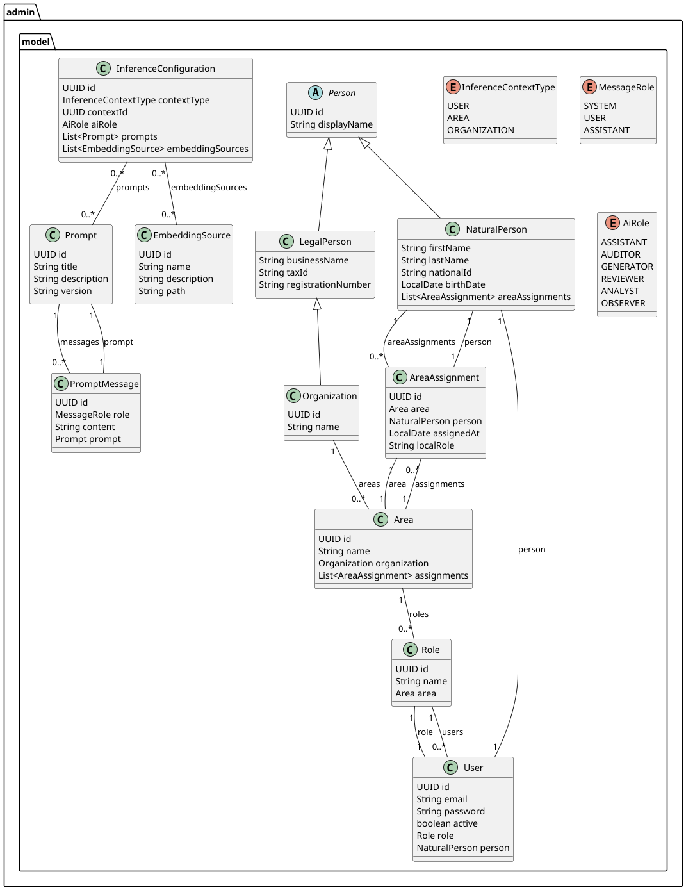
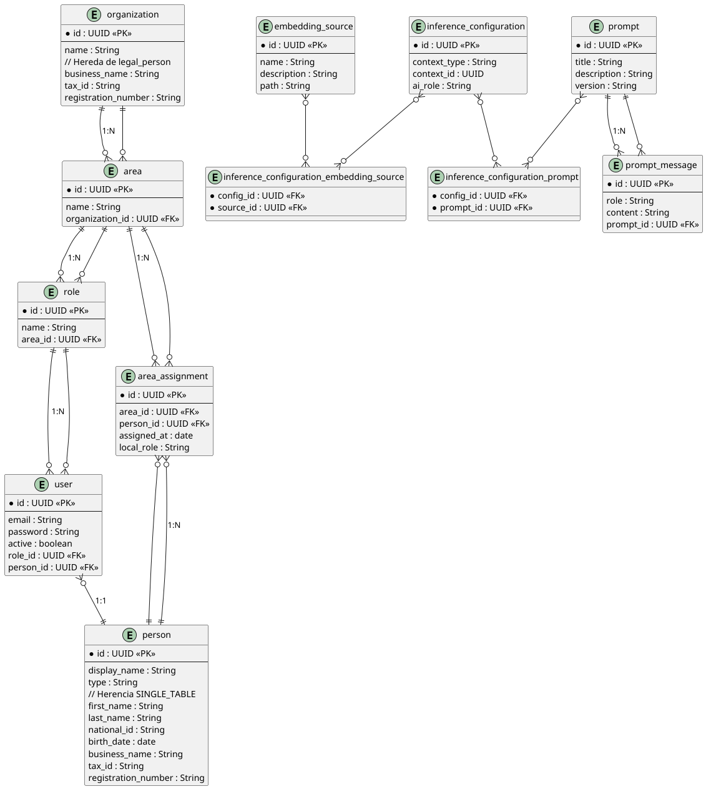

# Admin Domain Model - EvolvAI

Este documento describe en profundidad el modelo de dominio del paquete `admin.model` del proyecto EvolvAI. Su objetivo
es ayudar a nuevos integrantes del equipo a comprender la estructura de clases, relaciones entre entidades y su
finalidad dentro del contexto del sistema.

---

## ✨ Propósito del modelo `admin`

El modelo `admin` representa la estructura organizativa, los usuarios, sus roles, las personas (físicas y jurídicas) y
la configuración para el uso personalizado de la inteligencia artificial (IA) dentro del sistema EvolvAI.

---

## 📦 Scripts de inicialización

Para facilitar la instalación y pruebas del modelo, se incluyen los siguientes scripts:

* 🛠️ [init\_adm\_tables.sql](../scripts/init_adm_tables.sql): Crea todas las tablas necesarias del esquema `admin`.
* 🧪 [insert\_data.sql](../scripts/insert_data.sql): Inserta datos sintéticos útiles para pruebas y validaciones
  iniciales.

Podés encontrarlos en el directorio `/scripts` del repositorio o cargarlos en tu instancia local de PostgreSQL.

---

## 📘 Diagrama de Clases UML



> El diagrama completo está disponible en `/docs/uml/admin-class-diagram.puml`.

---

## 📋 Entidades principales

### `Person` (abstracta)

* Superclase de todas las personas del sistema.
* Atributos:

    * `UUID id`
    * `String displayName`

### `NaturalPerson`

* Representa personas físicas (individuos reales).
* Atributos:

    * `firstName`, `lastName`, `nationalId`, `birthDate`
    * Relacionada con varias `Area` mediante `AreaAssignment`.

**Ejemplo**:

```json
{
  "firstName": "Fabián",
  "lastName": "Agüero",
  "displayName": "Fabián Agüero",
  "nationalId": "12345678",
  "birthDate": "1985-06-15"
}
```

### `LegalPerson`

* Representa entidades legales (empresas u organizaciones).
* Subclase de `Person`.
* Atributos:

    * `businessName`, `taxId`, `registrationNumber`

### `Organization`

* Subclase de `LegalPerson`.
* Se vincula con una o más `Area`.

### `Area`

* Unidad organizativa dentro de una `Organization`.
* Asociada a:

    * Una organización.
    * Múltiples `AreaAssignment`.
    * Múltiples `Role`.

### `AreaAssignment`

* Relación entre `NaturalPerson` y `Area`.
* Atributos:

    * `assignedAt`, `localRole`

**Ejemplo**:

```json
{
  "person": "Fabián Agüero",
  "area": "AI Research",
  "assignedAt": "2023-01-10",
  "localRole": "Lead"
}
```

### `Role`

* Define un rol dentro de un área organizativa.
* Asociado a usuarios del sistema.

### `User`

* Entidad que representa al usuario del sistema (login/autenticación).
* Asociado a:

    * `Role` funcional.
    * `NaturalPerson` que lo representa.
* Atributos:

    * `email`, `password`, `active`

---

## 🤖 Inferencia personalizada

### `InferenceConfiguration`

* Define configuraciones específicas de inferencia por contexto:

    * `contextType`: `USER`, `AREA`, `ORGANIZATION`
    * `contextId`: referencia a la entidad destino
    * `aiRole`: rol de la IA en el contexto (`ASSISTANT`, `AUDITOR`, etc.)
* Asociada a:

    * Una lista de `Prompt`
    * Una lista de `EmbeddingSource`

### `EmbeddingSource`

* Define documentos o fuentes que nutren la IA.
* Atributos:

    * `name`, `description`, `path`

**Ejemplo**:

```json
{
  "name": "AI Whitepaper",
  "description": "Documentación básica para resumen",
  "path": "/docs/ai.pdf"
}
```

---

## 🔎 Prompts estructurados

### `Prompt`

* Contenedor de uno o varios mensajes.
* Atributos:

    * `title`, `description`, `version`

### `PromptMessage`

* Define un mensaje dentro de un `Prompt`, con rol semántico:

    * `SYSTEM`, `USER`, `ASSISTANT`
* Asociado a un `Prompt`.

**Ejemplo**:

```json
{
  "role": "SYSTEM",
  "content": "You are a helpful assistant."
}
```

---

## 📊 Diagrama ERD (relacional)



> Archivo fuente: `/docs/uml/admin-erd.puml`

---

## 🔐 Consideraciones finales

* Este modelo está 100% alineado con LangChain4j.
* Permite la personalización de prompts y embeddings por organización, área y usuario.
* Está preparado para escalar jerárquicamente.
* La modularidad permite reutilización en otros contextos del sistema.

---

✉ Si sos nuevo en el equipo y tenés dudas sobre este modelo, podés hablar con el autor original o consultar los ejemplos
en `/docs/examples/admin-model`.
